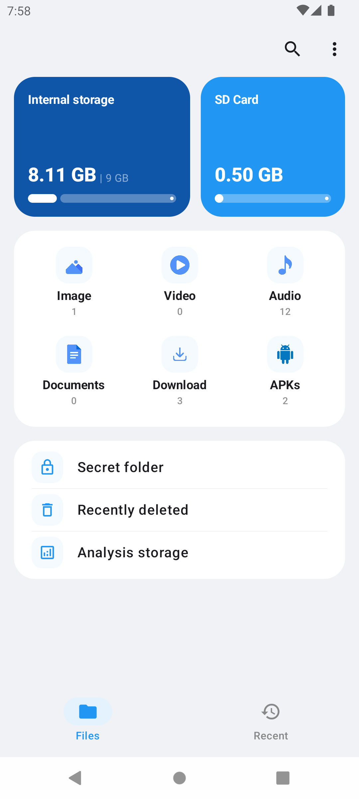
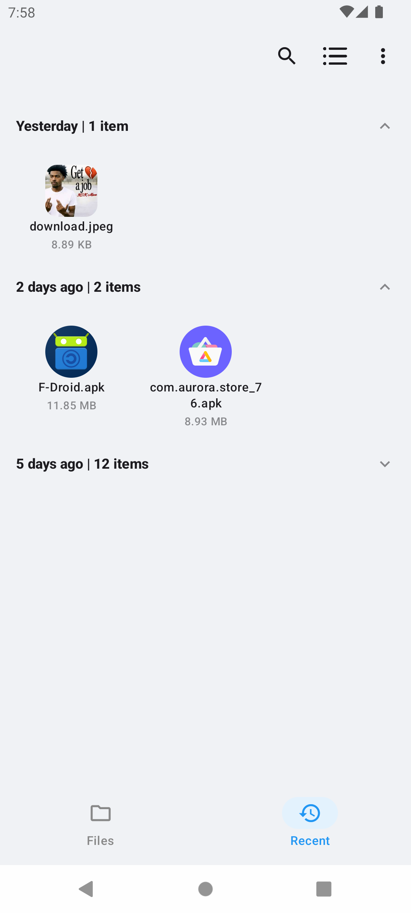
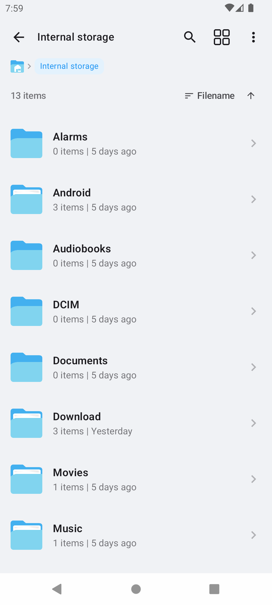
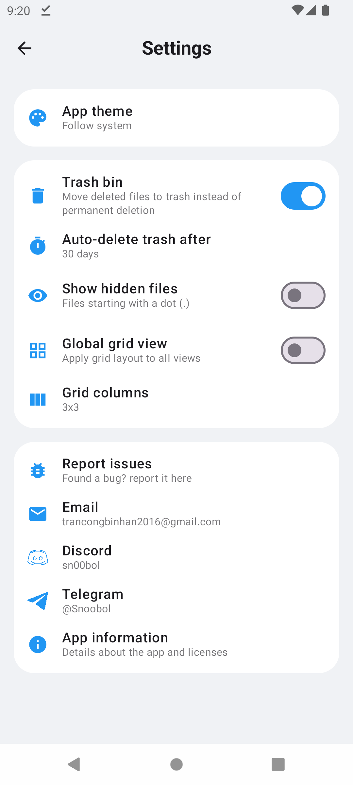

  <h1><b>Basda</b></h1>
  
A minimalist open-source file manager app for Android

  

    
    
    
  

  

    
  

Other documents:
- [Building from source](docs/INSTALL.md)
- [Changelog](docs/CHANGELOG.md)
- [Known issues](docs/ISSUES.md)

> [!warning]
> <b>THIS APP STILL IN DEVELOPMENT, SO YOU COULD ENCOUNTER BUGS/ISSUE WHILE USING THIS APP, PLEASE REPORT VIA [Issues](https://github.com/sn00bol/Basda/issues)</b>
>
> <b>ONLY DOWNLOAD FROM THE LINKS ABOVE. ALL OTHER SOURCES ARE FAKE OR MAY CONTAIN VIRUSES</b>
>
> <b>BASDA WILL AND NEVER HAVE ANY SUBSCRIPTION, PAYMENT, OR DONATION METHOD, I WILL NOT RESPONSIBILITY IF YOU DONATE TO UNKNOWN SOURCE</b>

## Feature
- Highly supporting root for Magisk/KSU (using libsu from topjohnwu)
- Viewing, extract, archive,... file faster and compressed files
- UI/UX using minimalist style and lightweight
- Advance and fast managing archive and searching files
- Support text editor (basic running code too) and watching video/audio without go to anywhere
- Support PDF viewer and other file format (e.g. docx, pptx, xlsx,...)

## Screenshots

 
          
 
 
 
 

## Translation

Currently, the app only supports **English**. Localization support and translation contributions will be added in upcoming releases. Stay tuned!

## need help or supporting
* **Email:** [trancongbinhan2016@gmail.com](mailto:trancongbinhan2016@gmail.com)
* **Discord:** [`sn00bol`](https://discord.com/users/870567726324805673)
* **Telegram:** [`Snoobol`](https://t.me/sn00bol)
